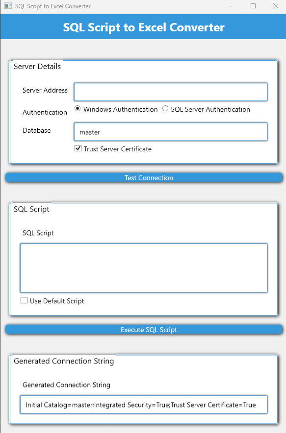

# SQLScript2XLSX

A powerful WPF application for converting SQL Server query results directly to Excel XLSX files.

---

## 📋 Overview

SQLScript2XLSX is a modern Windows desktop application built with .NET 9 that simplifies the process of exporting SQL Server query results to Excel spreadsheets. The application provides a clean, intuitive interface for database professionals and analysts who need to quickly transform query data into Excel format.

## ✨ Features

- **SQL Query Execution**: Run SQL scripts against Microsoft SQL Server databases
- **Secure Authentication**: Support for both SQL Server and Windows authentication
- **Password Protection**: Secure password handling with WPF password binding
- **Excel Export**: Generate professionally formatted Excel (XLSX) files
- **Result Preview**: View query results before exporting
- **Connection Management**: Save and reuse database connection strings
- **Modern UI**: Clean and responsive WPF interface with modern design principles

## 🖥️ Screenshots

  

## 🚀 Getting Started

### Prerequisites

- **Windows OS**: Windows 10 or later
- **.NET Runtime**: .NET 9.0 or later
- **Database Access**: SQL Server instance with appropriate permissions

### Installation Options

#### Download Pre-built Release

1. Navigate to the [Releases](https://github.com/yourusername/SQLScript2XLSX/releases) page
2. Download the latest `.zip` file
3. Extract contents to your preferred location
4. Run `SQLScript2XLSX_2.exe`

#### Build from Source

1. Clone the repository
2. Navigate to the project directory
3. Build the solution
4. Find the compiled application in the `bin\Release\net9.0-windows` directory

## 📖 Usage Guide

### Connecting to a Database

1. Launch the application
2. In the connection section, provide your SQL Server details:
   - Server name (e.g., `localhost` or `myserver.database.windows.net`)
   - Authentication type (Windows or SQL Server)
   - Database name
   - Credentials (if using SQL Server authentication)
3. Click "Connect"

### Executing SQL Queries

1. In the query editor, write or paste your SQL query
2. Click "Execute" to run the query
3. View results in the data preview grid

### Exporting to Excel

1. After executing a successful query, click "Export to Excel"
2. Choose a file name and location in the save dialog
3. Optionally configure Excel formatting options
4. Click "Save" to generate the XLSX file

## 🧰 Technical Details

### Dependencies

- [ClosedXML](https://github.com/ClosedXML/ClosedXML) (v0.104.2): Excel file generation 
- [Microsoft.Data.SqlClient](https://github.com/dotnet/sqlclient) (v5.2.2): SQL Server connectivity

### Architecture

The application follows MVVM (Model-View-ViewModel) pattern:
- **Models**: Database connection and query execution logic
- **ViewModels**: Data binding and command handling
- **Views**: WPF UI components and XAML

## 🔒 Security Considerations

- Connection strings with passwords are never saved to disk by default
- Passwords are securely handled via WPF's secure password controls
- The application uses parameterized queries to prevent SQL injection
- User credentials are not logged or stored in memory longer than necessary

## 🧪 Testing

The project includes comprehensive unit tests using MSTest. To run the tests:

Key test areas include:
- Password binding functionality
- SQL connection handling
- Query execution and result processing
- Excel conversion accuracy

## ❓ Troubleshooting

### Common Issues

**Connection Failure**
- Verify server name and credentials
- Ensure SQL Server is running and network accessible
- Check firewall settings

**Export Errors**
- Verify write permissions to destination folder
- Close any open Excel files with the same name
- Ensure query returned valid results

## 🤝 Contributing

Contributions are welcome! Please feel free to submit a Pull Request.

1. Fork the repository
2. Create your feature branch (`git checkout -b feature/amazing-feature`)
3. Commit your changes (`git commit -m 'Add some amazing feature'`)
4. Push to the branch (`git push origin feature/amazing-feature`)
5. Open a Pull Request

### Development Setup

1. Clone the repository
2. Open the solution in Visual Studio 2022 or later
3. Restore NuGet packages
4. Build the solution

### Coding Standards

- Follow Microsoft's C# coding conventions
- Use MVVM pattern for UI development
- Include XML documentation for public methods
- Add appropriate unit tests for new functionality

## 📄 License

This project is licensed under the MIT License - see the [LICENSE](LICENSE) file for details.

## 🙏 Acknowledgements

- [ClosedXML](https://github.com/ClosedXML/ClosedXML) team for their excellent Excel library
- Microsoft for .NET and SQL Server technologies
- All contributors who have helped improve this project

---

  
Made with ❤️ by [Your Name/Organization]

